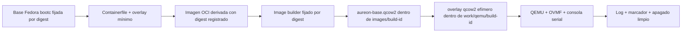

# Receta Fedora bootc — Fase 0

- Estado: experimento mínimo autorizado por digest; cada ejecución que cambie estado requiere aprobación explícita.
- Alcance: una derivación mínima de Fedora bootc para `x86_64`/UEFI que, en una VM aislada, emita un marcador de readiness por consola serial.
- Fuera de alcance: instalación de Aureon OS, particiones, discos físicos, usuarios, red del guest, escritorio gráfico, Secure Boot y distribución de imagen.

`bootc` gestiona sistemas que arrancan y se actualizan mediante imágenes de contenedor. Esta ruta de diseño parte de la documentación del proyecto [bootc](https://bootc-dev.github.io/bootc/) y de [Fedora/CentOS bootc](https://docs.fedoraproject.org/en-US/bootc/), pero no demuestra que Aureon haya sido construido ni arrancado.

## Material incluido

| Ruta | Función | Estado actual |
| --- | --- | --- |
| `system/Containerfile` | Derivación mínima de la base Fedora bootc. | Base `linux/amd64` fijada por digest. |
| `system/overlays/` | Metadatos del guest y unidad que imprime `AUREON_PHASE0_READY` solo en VM. | No contiene cuentas, contraseñas, llaves, red ni mounts del host; el `Containerfile` fuerza permisos de guest seguros. |
| `packaging/phase0-image-manifest.template.yaml` | Contrato de entradas, artefactos y controles. | Gate habilitado solo para el experimento explícitamente revisado. |

El marcador de readiness únicamente prueba que esa unidad se ejecutó en la VM. No prueba GPU, red, rendimiento, actualizaciones ni hardware físico.

## Puerta de build

`aureon-dev build` e `aureon-dev image` existen solo como planificadores de `--dry-run`: validan rutas y emiten un manifiesto por salida estándar, pero no invocan un builder ni crean archivos. Su opción `--execute` continúa fallando cerrada hasta que el runner quede implementado. El `FROM` usa la base Fedora bootc `linux/amd64` fijada por digest e idéntica al manifiesto; no hay un `ARG` que pueda sustituirla en línea de comandos.

La revisión previa ya completó estas acciones para habilitar un único experimento controlado:

1. Elegir una base Fedora bootc y comprobar que resuelve a `linux/amd64`.
2. Registrar su referencia inmutable completa, con digest `sha256` de 64 hexadecimales, tanto en `system/Containerfile` como en el manifiesto.
3. Inspeccionar y guardar procedencia, fecha, digest y metadatos locales de la base.
4. Fijar por versión, commit y digest el CLI unificado `image-builder`; el conversor histórico `bootc-image-builder` quedó excluido del experimento por su señal `build_tainted`.
5. Documentar el modo de ejecución, los mounts permitidos y las rutas de salida; cada llamada privilegiada sigue requiriendo aprobación explícita.
6. Crear, durante el build, un manifiesto por `build-id` con ambos digests, hashes, configuración efectiva y logs.

`build_gate.enabled` está en `true` únicamente para este experimento de Fase 0. Una referencia fijada en solo uno de los dos archivos sigue siendo un error de seguridad, y el gate no sustituye la aprobación humana de una operación privilegiada.

## Ruta prevista: OCI → `qcow2` → QEMU

La herramienta activa de osbuild crea imágenes de disco a partir de entradas bootc y documenta `qcow2` como tipo de salida. La selección de arquitectura de la base y del builder se verifica como `linux/amd64`; la guía de migración del proyecto describe el CLI unificado como ruta actual para builds nuevos: [documentación de bootc Image Builder](https://osbuild.org/docs/bootc/).

Para Fase 0 se selecciona explícitamente `ext4` como filesystem raíz del `qcow2`. Las imágenes Fedora bootc pueden requerir que el filesystem se declare en el conversor; no se permite una selección implícita. La razón y los límites del experimento están en [ADR-0003](../adr/0003-conversion-qcow2-y-consola-serial.md). La [inspección de metadatos de registro](../testing/registry-inspection-2026-07-19.md) registra las referencias `linux/amd64` y el CLI seleccionado; no reemplaza la aprobación explícita de cada llamada privilegiada ni la evidencia del build real.

La conversión futura debe consumir la referencia OCI derivada exacta, no un tag local. Antes de QEMU se guardará el hash del `qcow2`; QEMU abrirá `aureon-base.qcow2` como base de solo lectura y escribirá solo en un overlay nuevo asociado al `build-id`. El código OVMF será de solo lectura y cualquier variable UEFI escribible se copiará al directorio de trabajo del build. La configuración final se contrastará contra la [referencia oficial de QEMU](https://www.qemu.org/docs/master/system/invocation.html).

Los permisos del overlay no se heredan como política de seguridad: el `Containerfile` aplica explícitamente `0755` a sus directorios y `0644` al archivo de release, a la unidad systemd y al fragmento de kernel args. Esto evita que los permisos permisivos de un checkout Windows/WSL terminen dentro del guest. Un build habilitado deberá verificar esos modos con `stat` antes de publicar la evidencia.

El overlay también instala `20-aureon-phase0-serial.toml` bajo `/usr/lib/bootc/kargs.d/`; declara `console=tty0` y `console=ttyS0,115200n8`. Así el primer smoke test puede conservar salida local y capturar el arranque y `AUREON_PHASE0_READY` en el puerto serie de QEMU. La interfaz de `kargs.d` está documentada por bootc/image mode; su efecto se comprobará contra el `cmdline` y el log serial de la VM, no se supondrá solo por la presencia del archivo.

Para que la primera prueba sea acotada, `aureon-phase0-shutdown.service` se ejecuta únicamente en una VM, después del marcador, y solicita a systemd un `poweroff` no bloqueante. No existe en esta imagen usuario, contraseña ni canal remoto; por tanto el apagado de Fase 0 es el mecanismo de cierre de prueba. El runner debe considerar éxito solo si observa primero el marcador serie y después la salida limpia de QEMU; una terminación por timeout sigue siendo un fallo.

## Requisitos de preflight

Estos son requisitos para habilitar el primer build; no afirman que ya estén instalados ni operativos en WSL.

| Área | Requisito verificable | Evidencia |
| --- | --- | --- |
| Plataforma | Builder Linux `x86_64`: WSL2 configurado, host Linux o CI. | Distro, kernel, arquitectura y versión. |
| OCI | Podman capaz de construir e inspeccionar OCI por digest. | Ruta y versión; digest base/derivada. |
| Inspección | `skopeo` u otra herramienta que inspeccione el manifiesto OCI sin confiar en tag mutable. | Salida y plataforma `linux/amd64`. |
| Conversión | CLI unificado `image-builder` del upstream, fijado por versión, commit y digest. | Referencia, digest, versión, commit y modo. |
| VM | `qemu-system-x86_64`, `qemu-img` y OVMF x86_64 con rutas explícitas. | Versiones, hash/ruta OVMF y configuración. |
| Aceleración | `/dev/kvm` o TCG declarado como fallback funcional. | Acelerador y razón. |
| Capacidad | Al menos 30 GiB libres en filesystem Linux de artefactos y 8 GiB de RAM libres. | Medición previa y límites VM. |
| VM de referencia | 2 vCPU, 4096 MiB guest RAM, UEFI y disco `qcow2`. | Configuración QEMU en manifiesto. |
| Red | Solo para obtener entradas fijadas; smoke VM inicia sin red. | Modo de red y ausencia de bridge. |

El umbral de capacidad es un margen operativo de Aureon, no un mínimo publicado por Fedora u osbuild. Si la imagen real requiere más, se actualiza preflight antes de ejecutarla.

La documentación del CLI unificado indica que la generación puede requerir privilegios y mounts de almacenamiento. Es una operación separada que exige revisión: esta plantilla no la ejecuta ni presupone que sea segura por ser una VM. Véase la [guía upstream de Image Builder](https://osbuild.org/docs/developer-guide/projects/image-builder/usage/).

## Restricciones no negociables

- Solo se crean artefactos virtuales bajo el `build-id`: OCI, `qcow2`, overlay, log y manifiesto.
- Se rechaza cualquier dispositivo físico, incluidos `/dev/sd*`, `/dev/vd*`, `/dev/nvme*` y `/dev/disk/*`, como entrada, salida o argumento de QEMU.
- Nunca se usa una imagen `raw` de disco host ni se pasa un `PhysicalDrive`, partición Windows, root Linux, `/mnt/c` o `/dev` al guest.
- El builder futuro solo puede recibir mounts explícitamente aprobados: un directorio de salida vacío y localizado y, si el modo lo exige, un store de contenedores localizado. Nunca `$HOME`, credenciales, archivos de usuario, `/` ni dispositivos host.
- El guest de Fase 0 inicia sin red, bridge ni carpetas compartidas.
- No se pasan secretos por argumentos, variables, config de imagen ni artefactos QEMU.

Un `--privileged` de runtime no instala un sistema por sí mismo, pero amplía de manera importante el acceso del contenedor al Linux builder. El comando, allowlist y red se documentaron; cada llamada queda sujeta a aprobación explícita. No se usará `bootc install` en Fase 0.

## Criterio de cierre

Estos archivos entregan una receta segura y auditable, no una imagen. El próximo hito solo estará completo cuando un `build-id` produzca evidencia de una OCI con digest fijado, `qcow2` aislado, consola serial completa, `AUREON_PHASE0_READY` y apagado limpio. Hasta entonces no se afirmará que Aureon OS fue construido, arrancado o instalado.
