# Pipeline de Fase 0: build → imagen → QEMU → smoke → logs

- Estado: diseño inicial; no implica que el pipeline esté implementado.
- Alcance: imagen mínima x86-64 UEFI que llega a consola en una VM aislada.
- Fuera de alcance: instalación física, login gráfico, aceleración GPU validada, actualizaciones de usuario y pruebas de hardware real.

## Objetivo operativo

Desde un checkout limpio, el futuro comando `aureon-dev test-smoke` debe construir una imagen mínima, arrancarla en QEMU con almacenamiento virtual, confirmar que systemd alcanzó el estado esperado, ejecutar una comprobación acotada dentro del guest, recopilar evidencia y apagar la VM. El comando no debe tocar discos físicos ni requerir cambios persistentes en Windows.

El contrato de salida previsto incluye:

- ID de build y referencia del código fuente empleado.
- Hash de la imagen y ruta exacta de la imagen de VM.
- Acelerador seleccionado (`WHPX`, `KVM` o `TCG`) y motivo de fallback si aplica.
- Tiempo de arranque medido desde el lanzamiento de QEMU hasta el marcador de readiness del guest.
- Resultado de cada aserción del smoke test.
- Rutas de logs seriales, manifiesto y otros artefactos.
- Confirmación de apagado limpio, o el motivo por el que no se consiguió.

## Flujo propuesto

```mermaid
flowchart LR
  A["Checkout limpio"] --> B["Preflight: aureon-dev doctor"]
  B --> C["Build de imagen OCI en entorno Linux"]
  C --> D["Manifiesto y hash de imagen"]
  D --> E["Crear disco qcow2 aislado"]
  E --> F["Crear snapshot efímero de prueba"]
  F --> G["Arrancar QEMU + OVMF + consola serial"]
  G --> H{"¿Guest listo?"}
  H -->|"sí"| I["Smoke test dentro de la VM"]
  I --> J["Recopilar logs y métricas"]
  J --> K["Apagado limpio de la VM"]
  H -->|"no"| J
  K --> L["Resultado y artefactos conservados"]
```



Un fallo no salta la captura de evidencia. Las rutas y el manifiesto se escriben antes de arrancar QEMU para que un fallo temprano también sea diagnosticable.

## Límites de aislamiento

| Recurso | Regla de Fase 0 |
| --- | --- |
| Disco | Solo `qcow2`, overlays o raw temporales creados bajo el árbol de artefactos. No se pasan dispositivos físicos a QEMU. |
| Firmware | OVMF se referencia como dependencia de VM; no se modifica el firmware ni el bootloader del host. |
| Red | Deshabilitada por defecto para el smoke. Si una prueba futura la necesita, usa una configuración declarada y limitada, nunca bridge implícito. |
| Host | No se montan particiones del host dentro del guest. Los resultados vuelven por consola serial o un canal de pruebas explícito. |
| Credenciales | El guest de prueba no recibe secretos del desarrollador ni del CI. |
| Limpieza | Solo se permiten operaciones sobre el build ID actual tras validar que su ruta queda dentro del directorio de artefactos. |

## Distribución de artefactos prevista

La implementación puede ajustar los nombres, pero debe conservar el aislamiento por build ID. Una forma de referencia es:

```text
build/<build-id>/
  manifest.json          # entradas, versiones, hashes y configuración efectiva
  oci/                   # resultado de composición de imagen
images/<build-id>/
  aureon-base.qcow2      # imagen virtual base, nunca un disco del host
work/qemu/<build-id>/
  smoke-overlay.qcow2    # estado efímero de una ejecución de prueba
  serial.log             # consola serial completa
  qemu.log               # salida del lanzador/hipervisor
  smoke.json             # aserciones y resultado estructurado
  shutdown.json          # evidencia de apagado o timeout
```

Los directorios de artefactos deben estar excluidos del control de versiones salvo ejemplos deliberadamente pequeños. El manifiesto debe permitir asociar cada log con la imagen exacta que se ejecutó.

## Etapas y condiciones de paso

### 1. Preflight

`aureon-dev doctor` inspeccionará de modo no destructivo las herramientas y capacidades necesarias: entorno Linux de build, runtime de contenedor, QEMU, firmware UEFI disponible y aceleración posible. También imprimirá las rutas de salida configuradas. Un diagnóstico no instala dependencias ni modifica el host.

La etapa falla si falta una dependencia imprescindible o si una ruta de salida se resuelve fuera del espacio permitido. El informe debe distinguir “no instalado” de “detectado pero no verificado”.

### 2. Build y composición

El build toma fuentes fijadas, una definición de imagen y versiones registradas en un manifiesto. Debe generar una imagen OCI mínima sin incorporar credenciales ni herramientas de desarrollo que no pertenezcan al perfil. Antes de convertirla o arrancarla, calcula y guarda su hash.

En Fase 0 no se declara éxito de composición solo porque el contenedor terminó: la siguiente etapa debe consumir exactamente el digest registrado.

### 3. Preparación de disco virtual

La imagen de VM y su overlay se crean con nombres deterministas dentro del build ID. El runner valida primero que ambos destinos son archivos nuevos o artefactos previamente creados por el mismo build. El disco base se abre de forma que el smoke pueda trabajar sobre un overlay efímero cuando la herramienta lo permita; así un fallo no contamina la base.

### 4. Arranque y readiness

QEMU usa UEFI, una consola serial capturada y el mejor acelerador que el preflight haya confirmado. La selección no se infiere después: se registra en el manifiesto y en la salida humana.

El guest debe emitir un marcador de readiness diseñado para Fase 0 después de alcanzar el target de systemd acordado (inicialmente, un entorno de consola mínimo). La implementación puede usar una unidad de sistema específica o un agente de pruebas, pero debe documentar el mecanismo exacto. Ver una línea de firmware o un PID de QEMU no satisface esta condición.

### 5. Smoke test dentro del guest

El smoke inicial será pequeño y observable. Como mínimo comprobará que el guest arrancó la imagen esperada, que systemd está operativo y que se puede producir un resultado estructurado. Las comprobaciones adicionales se añadirán solo cuando tengan una condición de éxito, una salida de diagnóstico y un procedimiento de rollback claros.

El canal de ejecución debe ser explícito: consola serial o acceso local de VM configurado para la prueba. No se permite depender de un servicio remoto o de un recurso del host no registrado en el manifiesto.

### 6. Recolección y apagado

Tras éxito o fallo, el runner recopila la consola serial completa, configuración efectiva de QEMU, resultado del smoke y tiempos. Solicita apagado limpio al guest y espera un límite de tiempo declarado. Si necesita finalizar QEMU por timeout, conserva esa condición como fallo; no la presenta como apagado limpio.

La limpieza de overlays efímeros solo podrá ocurrir después de guardar la evidencia y nunca borrará la imagen base ni artefactos de otros build IDs sin una acción explícita del usuario.

## Política de errores y reintentos

- Cada etapa genera un resultado estructurado y un código de salida inequívoco.
- Un fallo de readiness adjunta las últimas líneas seriales, pero conserva el log completo.
- Un reintento crea un build ID nuevo o declara expresamente que reutiliza una imagen cuyo hash se verificó; no mezcla resultados silenciosamente.
- La indisponibilidad de WHPX o KVM permite usar TCG para validar funcionalidad, pero el informe debe marcarlo. Sus tiempos no se comparan como benchmarks con otra aceleración.
- Las pruebas de actualización, rollback, UI o rendimiento no se consideran parte del smoke de Fase 0; tendrán sus propios flujos y artefactos.

## Integración continua prevista

El job de CI de Fase 0 deberá invocar el mismo punto de entrada de alto nivel que una máquina de desarrollo Linux, conservar los artefactos ante fallo y publicar el manifiesto y logs seriales como evidencia. La configuración concreta del runner, registro OCI y firma no está seleccionada aún; por tanto, esta arquitectura no presupone ningún proveedor de CI.

## Evidencia necesaria para el criterio de salida

Fase 0 solo podrá declararse completada cuando una ejecución documentada muestre un checkout limpio, un build reproducible, la ruta de un `qcow2` aislado, logs seriales, el target de systemd alcanzado, un smoke test aprobado y la confirmación de apagado limpio. El resultado debe indicar con honestidad lo que no se probó, incluido hardware físico y escritorio gráfico.
